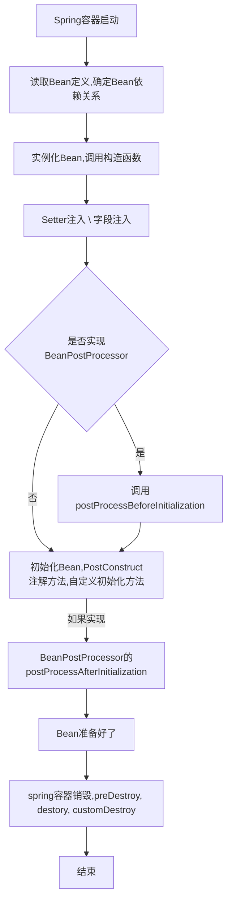

## Spring三级缓存

想起之前面试被问到的一个回答的不好的基础题，“spring如何解决循环依赖的？”

因为并没有真正理解spring缓存机制和作用，所以早起看过后就忘了，现在重新复习下。

跟着GPT一步步学 Spring 三级缓存。

### 什么是spring三级缓存

spring三级缓存，是spring框架用于解决单例作用域Bean的循环依赖问题的一种机制。

1. Singleton Objects Cache 单例对象缓存： 这个缓存存储已经完全初始化的单例Bean. 这个阶段，所有依赖已经注入，所有生命周期方法已经执行完毕。当一个bean被请求时，spring首先会从这个缓存中获取Bean。
2. Early Singleton Objects Cache 早期单例对象缓存：这个缓存存储已经实例化，但未完全初始化的Bean。相比 Singleton Objects Cache,  它的依赖注入和生命周期方法并没完成。 当Singleton Objects Cache中找不到Bean时候，会去这里找Bean， 以解决循环依赖。需要注意的是，如果是构造函数的注入，那么实例化阶段就要注入，此时有循环依赖是无法解决的。
3. Singleton Factories Cache 单例工厂缓存。这个缓存存储了创建bean的工厂对象。当在Early Singleton Objects Cache 也知道不到Bean， spring会尝试从这个缓存中获取工厂对象创建一个提前暴露的Bean实例。这个实例被放入到 Early Singleton Objects Cache 中， 以解决循环依赖的问题。

根据以上介绍我们知道，一级缓存存的是满状态的Bean， 二级缓存存的是构建好，但没初始化话好的Bean，三级缓存存的是单例工厂缓存。 无论何种方式，要装配都要先有实例才能依据实例来进行装配，所以如果是构造函数注入的循环依赖，spring三级缓存是无法解决的。

### Spring Bean作用域

了解了三级缓存后，我们知道以上都是对单例bean的操作，那么来复习下spring作用域有哪些。

1. Singleton 单例。整个spring容器中，一个类的单例Bean实例只会被创建一次。这是Spring默认的作用域
2. Prototype 原型。每次请求一个Bean时候，都会创建一个新的实例。
3. Request  请求。每一个HTTP请求的生命周期内，一个Bean的实例只会被创建一次。这个作用于仅适用于Web应用程序。
4. Session  会话。在一个HTTP会话的生命周期内，一个Bean的实例只会被创建一次。这个做用户仅适用于Web应用程序。
5. Application  应用。 在一个ServletContext的生命周期内，一个Bean的实例只会被创建一次。这个作用域仅适用于Web应用程序。

### Spring Bean生命周期

既然说到了注入，就来了解下注入时候spring做了哪些事。

Spring Bean 生命周期简化概述：

1. Spring容器启动
2. Bean 定义被读取，Spring确定Bean的依赖关系。
3. 实例化Bean, 调用构造函数。
4. Setter 注入：spring 容器注入带有 @Autowired 注解的依赖项
5. 如果实现了 BeanNameAware  、BeanFactoryAware 等接口，调用相应的方法。
6. 如果Bean实现了BeanPostProcessor接口，调用postProcessBeforeInitialization方法
7. 初始化Bean， 这可能包括调用 @PostConstruct 注解的方法、调用afterPropertiesSet方法(如果实现了InitializingBean接口) 或调用自定义的初始化方法 (通过@Bean(initMethod="customInit")指定)。
8. 如果Bean实现了BeanPostProcessor接口，调用 postProcessAfterInitialization方法
9. Bean 现在已经准备好使用。
10. 当应用程序关闭或Spring容器被销毁时，执行清理操作，包括调用@PreDestory注解的方法，调用destroy方法(如果实现了DisposableBean接口) 或调用自定义的销毁方法(通过@Bean(destroyMethod="customDestroy")指定)



### Spring提供了哪些依赖注入方式：

1. 构造器注入 (Constructor Injection)
2. Setter注入 (Setter Injection)
3. 字段注入 (Field Injection)

简单代码示例：

1. #### 构造器注入

```java
@Component
public class A {
    private B b;

    @Autowired
    public A(B b) {
        this.b = b;
    }
}


```


2. #### Setter注入

```java
@Component
public class A {
    private B b;

    @Autowired
    public void setB(B b) {
        this.b = b;
    }

}


```


#### 3. 字段注入

```java
public class A {
    @Autowired
    private B b;

}


```


实际开发中，构造器通常是首选依赖注入方式，因为可以确保Bean在创建时候就完全初始化，避免潜在空指针异常。Setter注入和字段注入虽然某些生活更方便，但会导致Bean处于不完全初始化状态。所以优先考虑构造器注入。
